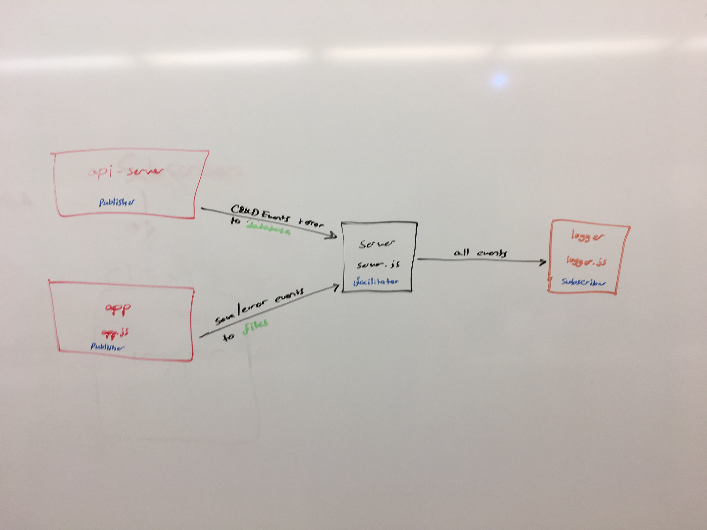

# LAB - 19

## Socket.io - Message Queue Server

### Author: Michael

### Links and Resources
* [submission PR](https://github.com/michaelchapman-401-advanced-javascript/lab-19-app/pull/1)
* [travis](https://travis-ci.org/michaelchapman-401-advanced-javascript/lab-19-app)

### Modules
#### `app.js`
##### reads file, modifies content, write content back to file

###### `readFileWrapper(fileName) -> file data`
Read the contents of a file and return it

###### `writeFileWrapper(fileName, text) -> file data`
Take the data and write it back to the appropriate file

###### `caps(text) -> text`
Take the text and turn it to all caps

### Setup
#### `.env` requirements
* Q_SERVER

#### Running the app
* `node app.js <filepath>`

#### Tests
* npm test

#### UML

